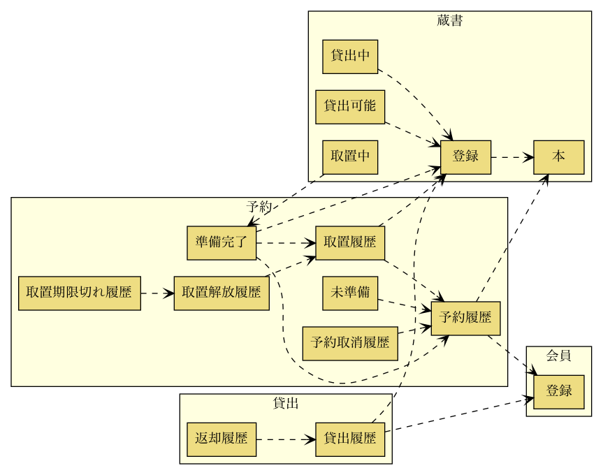
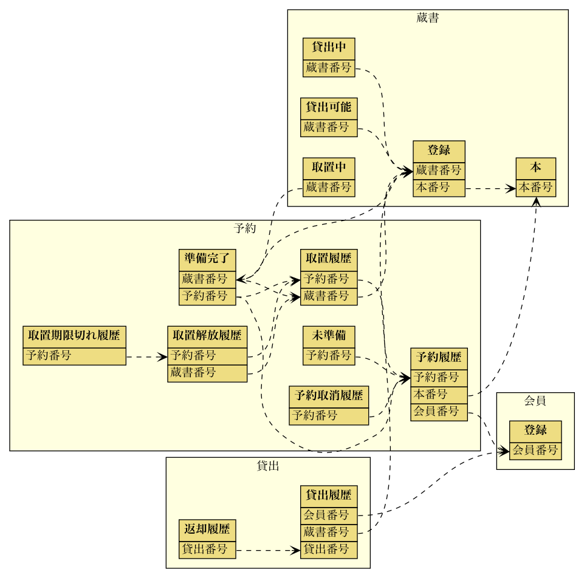

# JIG-ERD

[](https://github.com/irof/jig-erd/actions?query=workflow%3ACI)
[](https://ci.appveyor.com/project/irof/jig-erd/branch/master)

ざっくりなERダイアグラムを出力します。
現在はH2Databaseのみに対応しています。

テーブルの関連だけに着目した設計の補助道具です。
詳細な情報が欲しくなったら、他のツールを使用しましょう。

## サンプル

以下は [system-sekkei/library](https://github.com/system-sekkei/library) で出力したサンプルです。2種類のダイアグラムが出力されます。

- `jig-er-summary.svg`: スキーマ、テーブルのみ
- `jig-er-detail.svg`: スキーマ、テーブル、外部キーカラム

### スキーマ、テーブルのみ


### スキーマ、テーブル、外部キーカラム


## 前提条件

- Java11以降がインストールされていること
- Graphvizがインストールされていること

### versions

|対象 |推奨 |動作確認済 |
|----|----|----|
|Java|11以降| AdoptOpenJDK 11.0.7 |
|Graphviz|最新| 2.44.1 |
|H2 Database Engine|最新| 1.4.200  |
|OS|- | macOS Catalina 10.15.5  |

## Getting Started

依存関係に追加する。

```groovy
repositories {
    maven {
        url "https://dl.bintray.com/jignite/maven/"
    }
}

dependencies {
    testImplementation 'irof:jig-erd:0.0.2'
}
```

実行する。

```java
@SpringBootTest
public class Erd {

    @Test
    void run(@Autowired DataSource dataSource) {
        JigErd.run(dataSource);
    }
}
```

`javax.sql.DataSource` を使って出力します。
上記ではSpringBootTestを使用してテストコードで実行しています。
これはマイグレーションや`DataSource`をSpringBootに任せるためです。

他の出力例は [wiki](https://github.com/irof/jig-erd/wiki) を参照してください。

## リリース

### GitHub Packages

Tagを作るとGitHub Actionsがやります。

### bintray

```
VERSION=0.0.2 ./gradlew bintrayUpload
```

## 未定な予定

- [x] H2database
- [ ] Windows
- [x] FKのカラムくらいはだす
- [ ] 出力形式や出力先などの設定
- [ ] PostgreSQL
- [x] TABLEのCOMMENTを使う
- [ ] PK/UKのカラムをだす？
- [ ] COLUMNのCOMMENTを使う？
- [ ] SpringBootStarter
- [ ] スタンドアロン
- [ ] jCenter
- [ ] 他のDB

## LICENSE

[Apache License 2.0](LICENSE)
