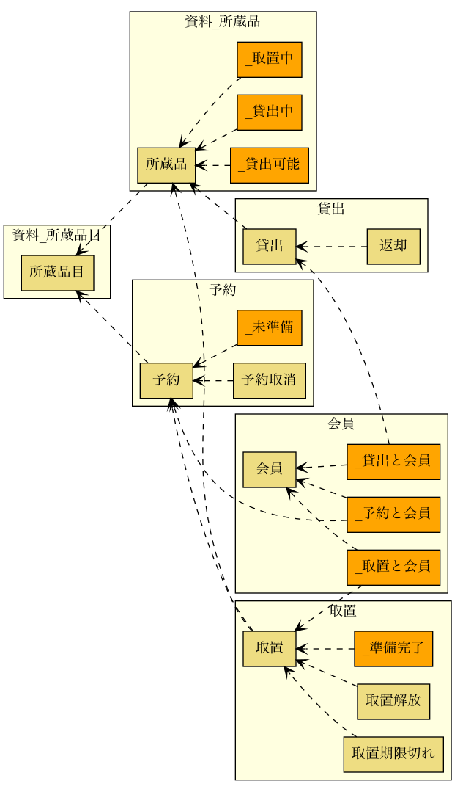

# JIG-ERD

[](https://github.com/irof/jig-erd/actions?query=workflow%3ACI)
[](https://ci.appveyor.com/project/irof/jig-erd/branch/master)

ざっくりなERダイアグラムを出力します。
現在はH2DatabaseとPostgreSQLのみに対応しています。

関連だけに着目したデータベース設計の補助道具です。

PKや列のデータ型、その他制約と言った一般的なER図で必須な項目は扱っていません。対応予定もないです。詳細な情報は他のツールの使用をお勧めします。

## サンプル

以下は [system-sekkei/library](https://github.com/system-sekkei/library) で出力したサンプルです。3種類のダイアグラムが出力されます。

- `jig-erd-overview.svg`: スキーマのみ
- `jig-erd-summary.svg`: スキーマ、テーブルのみ
- `jig-erd-detail.svg`: スキーマ、テーブル、外部キーカラム

ファイル名、形式は設定で変更できます。

### スキーマのみ


### スキーマ、テーブルのみ


### スキーマ、テーブル、外部キーカラム


## 前提条件

- Java11以降がインストールされていること
- Graphvizがインストールされていること
    - 出力形式を `DOT` にした場合は不要。この場合は自分で変換を行ってください。

### versions

|対象 |推奨 |
|----|----|
|Java|11以降|
|Graphviz|2.44.1 |
|H2 Database Engine|1.4.200  |
|PostgreSQL |11.1  |

#### 動作確認環境

|OS |Java |Graphviz |
|----|----|----|
|`macOS Catalina 10.15.5`| `AdoptOpenJDK 11.0.7`| `2.44.1` |
|`Windows 10`| `jdk-14.0.2_windows-x64_bin.exe`| `2.44.1` |
|GitHub Actions ubuntu-latest|`11` | `2.40.1` |
|AppVeyor visual studio 2015|`11` |`2.38.0` |


## Getting Started

### コマンドラインから使う

- jig-erd-x.x.x.jarをダウンロード
    - [GitHub Packages](https://github.com/irof/jig-erd/packages/344869) から
- JDBCドライバ（ `postgresql-42.2.14.jar` など ）をダウンロード
    - [JDBCドライバダウンロードページ](https://jdbc.postgresql.org/) などから
- 以下のコマンドを実行

```
java -cp jig-erd-x.x.x.jar:postgresql-42.2.14.jar \
    jig.erd.JigErd {url} {user} {password}
```
url, user, passは適宜置き換えてください。urlは `jdbc:postgresql://localhost:5432/test` とかです。

### Spring Boot Testで使う

依存に追加する。

```groovy
repositories {
    maven {
        url "https://dl.bintray.com/jignite/maven/"
    }
}

dependencies {
    testImplementation 'irof:jig-erd:latest.release'
}
```

実行する。

```java
@SpringBootTest
public class Erd {

    @Test
    void run(@Autowired DataSource dataSource) {
        JigErd.run(dataSource);
    }
}
```

`javax.sql.DataSource` を使って出力します。
上記ではSpringBootTestを使用してテストコードで実行しています。
これはマイグレーションや`DataSource`をSpringBootに任せるためです。

他の出力例は [wiki](https://github.com/irof/jig-erd/wiki) を参照してください。

## 設定

`jig.properties` ファイルをクラスパスか実行時のカレントディレクトリに配置してください。

```properties
jig.erd.output.directory=./build
jig.erd.output.prefix=library-er
jig.erd.output.format=png
jig.erd.output.rankdir=LR
```

|キー|意味|許容する値|設定しない場合のデフォルト|
|----|----|----|----|
|`jig.erd.output.directory` |出力先ディレクトリ|任意のディレクトリ |カレントディレクトリ |
|`jig.erd.output.prefix` |出力ファイル名のプレフィックス |英数、記号（`-_.`） |`jig-erd` |
|`jig.erd.output.format` |出力ファイルの形式 |`SVG`, `PNG`, `DOT`(テキスト) |`SVG` |
|`jig.erd.output.rankdir` |ダイアグラムの方向 ([参考](https://graphviz.org/doc/info/attrs.html#d:rankdir)) |`LR`, `RL`, `TB`, `BT` |`LR` |

ファイル名は `{jig.erd.output.prefix}-detail.{拡張子}` などになります。

## リリース

### GitHub Packages

Tagを作るとGitHub Actionsがやります。

### bintray

```
VERSION=0.0.5 ./gradlew bintrayUpload
```

## LICENSE

[Apache License 2.0](LICENSE)
